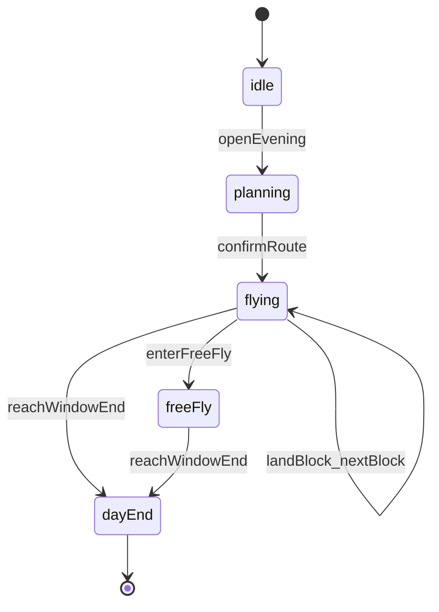
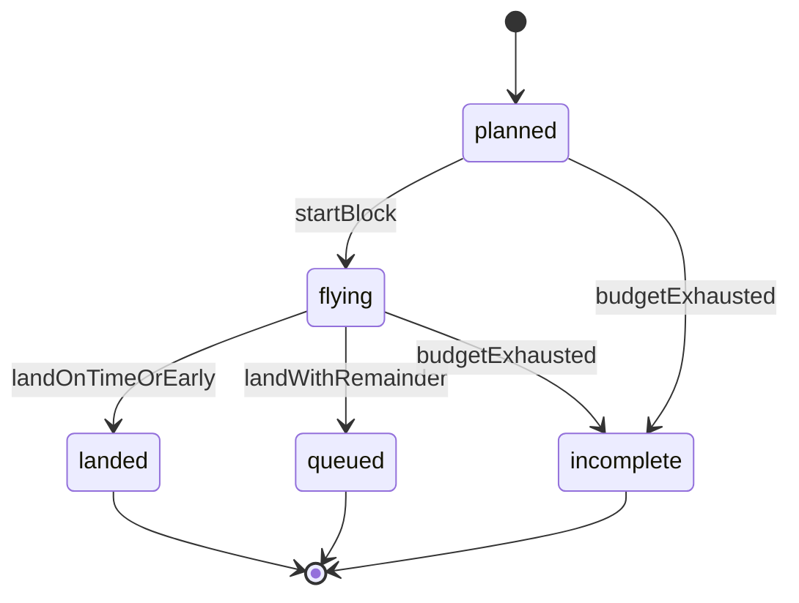

# Time Flight 产品需求文档（PRD）

## 1. 文档信息

| 字段 | 内容 |
|------|------|
| 产品名称 | Time Flight（时光航班） |
| 版本 | MVP v0.3 |
| 状态 | Draft |
| 目标平台 | 响应式 Web（平板书桌场景优先，手机可查看摘要与家长配置） |
| 文档语言 | 中文 |
| 最后更新 | 2026-08-31 |

### 1.1 背景摘要

典型家庭晚间场景：12 岁孩子在 19:30 前后完成学校作业后，拥有约 120 分钟（19:30–21:30）的自主时间，需自行安排课外巩固（1–2 科）、每日英语朗读（15 分钟）、水果休息（约 15 分钟）及自由活动。现实中孩子缺乏时间总量概念，任务拖沓、订正挤占睡前时段，引发亲子对抗，导致学习成果与情绪双输。

Time Flight 不试图「教」孩子一套时间管理方法论，而是通过可操控的软件工具，让孩子在每日行为中看见时间、排程、进港，获得**掌控感**，从而养成时间观念。

### 1.2 关联文档

- 本文档为 MVP 唯一需求基线，后续设计稿与开发任务均以此为准。

---

## 2. 问题陈述与产品愿景

### 2.1 核心问题

1. **时间 blindness**：孩子对「120 分钟能做什么」没有稳定概念，任务边界过大（如「做一套卷」），易磨蹭。
2. **订正错位**：订正常被感知为 Bedtime 前的附加惩罚，而非晚间计划的一部分，导致敷衍与抗拒。
3. **负向循环**：家长 21:00 后言语批评 → 孩子反感 → 效率更低 → 批评加剧。
4. **虚假轻松感**：晚饭前「作业做完了」的口头汇报，未覆盖晚间巩固全清单，加剧晚间松散。

### 2.2 产品愿景

> 让孩子通过 Time Flight，在 19:30–21:30 内**自主排航程、按起飞、到点进港**，从每日行为中自然建立时间观念；家长在边界内薄参与，晚间结束时亲子情绪正向。

### 2.3 非目标（MVP 明确不做）

| 非目标 | 说明 |
|--------|------|
| 教 Agile / TimeBox 概念 | 理念内化于产品机制，UI 不出现术语 |
| 题库 / 讲题 / 批改 | 不做学科内容，只做时间与块管理 |
| 实时家长监控 | 不做走神检测、远程盯屏、惩罚性推送 |
| 积分商城 / 排行榜 | 避免外在动机绑架与羞辱性比较 |
| 17:00–19:30 作业全流程 | MVP 仅可选「学校作业已完成」轻量勾选 |
| 多账号 / 云端同步 | MVP 本地优先，单设备 profile |

---

## 3. 用户与场景

### 3.1 Primary Persona — 孩子（12 岁）

| 维度 | 描述 |
|------|------|
| 典型场景 | 19:30 学校作业完成，需自行巩固 1–2 科 |
| 显性目标 | 完成妈妈/爸爸期望的巩固与朗读 |
| 隐性动机 | 早点弄完，留时间玩 |
| 痛点 | 任务太大无边界；订正像惩罚；不知道还剩多少能玩的时间 |
| 技术习惯 | 能使用平板浏览器；不喜欢「被管」的系统 |

### 3.2 Secondary Persona — 家长

| 维度 | 描述 |
|------|------|
| 角色 | 边界设定者、模板维护者，非 nightly 微操者 |
| 目标 | 晚间学习有收获、21:30 前结束、减少 21:00 后冲突 |
| 行为约束 | 查看中性日结；21:30 后不追加任务、不人格批评（见附录 D） |

### 3.3 典型晚间时间线（业务事实）

```
17:00  放学到家，开始学校作业
18:00  晚餐
       餐后继续作业
19:30  学校作业基本完成 ──► Time Flight 核心窗口开始
19:30–21:30  孩子自主的 120 分钟「晚间航程」
  ├─ 必做：英语课文朗读 15 分钟
  ├─ 自选：1–2 科巩固（如数学，或数学+英语）
  ├─ 经停：约 20:30 水果 15 分钟
  └─ 剩余：自由飞行（自由活动，仍在 21:30 前）
21:30  今日进港（洗漱 / 睡前）
```



```mermaid
gantt
    title TypicalWeekdayEvening
    dateFormat HH:mm
    axisFormat %H:%M
    section School
    Homework           :17:00, 150m
    section TimeFlight
    EveningWindow      :19:30, 120m
```

### 3.4 使用环境

- **主设备**：平板竖放于书桌（≥768px 宽度）
- **辅助**：家长用手机访问 `/settings` 与查看日结摘要
- **网络**：本地优先，断网不影响当晚计时

---

## 4. 产品原则（设计宪法）

以下原则为设计与开发的最高优先级约束，冲突时以此为准。

1. **掌控感优先**  
   孩子自己排序航段、按「起飞」、点「进港」；到点由**系统轻提醒**，超时后**静默联动扣减**后续预算，**不弹窗打断**当前学习，亦非家长口令。

2. **时间池可视化**  
   120 分钟为固定「燃料」。添加学习块 = 挤占自由飞；提前进港 = 省下的整分钟**平均分配**给后续待飞航段；**超时 = 后续待飞航段预算联动扣减**（水果经停除外），让孩子看见「用掉就没了」。自由飞恒为执飞顺序最后一程，时间变动的净效应最终体现在自由飞上。

3. **中性反馈**  
   只展示事实（计划时长 / 实际时长 / 明早队列），不使用「效率低」「态度差」等评价性文案。

4. **订正即航段**  
   订正为独立、有时长的航段，排在 21:30 前进港，不是 Bedtime 前的附加刑。

5. **家长薄参与**  
   家长 weekly 配置模板与硬边界；evening 执行期不代选块、不代按起飞、不在 21:00 后批评。

6. **自由飞显式化**  
   自由时间不是「学完了意外获得」，而是航程表中可看见、可赚取的时间块；执飞顺序上恒为最后一程（进港终点之前）。

---

## 4.1 时间增减规则（v0.3 基线）

以下五条为时间引擎的**唯一业务规则**，实现与文案均须一致。所有时间运算以**整分钟**为单位，四舍五入，**不出现秒**。

### 规则 1 · 水果经停（刚性时长，顺序可调）

- 默认 **15 分钟**水果经停时长为**刚性**：不参与超时联动扣减，也不参与提前进港的时间分配。
- 孩子可在制定航程时**调整水果经停在列表中的顺序**（拖拽排序）。
- 起飞时水果经停始终按计划的 15 分钟执飞，不受前面航段超时或提前影响。
- **水果经停超时**（超过 15 分钟仍未点「续飞」）时，同样启动对**后续待执飞项**的联动扣减，规则与规则 4 相同；水果经停自身时长不被扣减。

### 规则 2 · 自由飞顺序与净效应

- **执飞顺序**：自由飞在除「进港终点（terminal）」外的所有航段中，**恒为最后一程**；制定航程时系统将其固定在列表末尾，不可被拖到学习块之后、进港之前以外的位置。
- **净效应**：前面航段超时扣减、提前释放等联动的**累积结果**，最终都体现在自由飞的剩余预算上——因为自由飞是最后一项待飞航段，且参与联动分配/扣减（水果经停除外）。

### 规则 3 · 进港时刻与「延长航程」

- 默认 **21:30** 为刚性进港时刻（`windowEnd`），当晚航程必须在此结束（进入日结）。
- 孩子可在**执飞页、当前航段执飞中**使用一次 **「延长航程 10 分钟」**（可配置，默认 10）：当晚进港时刻推迟至 **21:40**，**整晚仅一次机会**（`voyageExtended`），用后按钮不再出现。
- **不可用时机**：水果经停期间、自由飞行期间、航段过渡页（checkpoint）等非执飞状态。
- 延长航程获得的 10 分钟**全部加在当前正在执飞航段的时间预算**（`activeBudgetMinutes` / `remainingBudgetMinutes`），并同步更新 `windowEndAt` 与进港终点标题；**不加给自由飞**。
- 若当前航段提前进港且仍有未用完的延长分钟，剩余部分按规则 5 平均分配给后续待执飞项。

### 规则 4 · 超时联动扣减

- 任意航段（含水果经停自身执飞时）若**超过本段可用预算且仍未进港**，启用**联动扣减**：
  - **参与项**：当前航段之后、所有**待执飞**航段（`status` 为 planned/flying 且预算 > 0），**含自由飞**，**不含水果经停**、不含已 landed/incomplete 项、不含 terminal。
  - **扣减方式**：最小单位 **1 分钟**。每累计超时 **1** 分钟，按后续待飞**顺序**从参与项中扣 **1 项 1 分钟**（轮转）；执飞页预算条同步更新，无弹窗打断。联动 3 项时：超时 1 分钟扣第 1 项，超时 2 分钟再扣第 2 项，超时 3 分钟再扣第 3 项。不满一轮的余数**不丢弃**。
  - 某参与项预算降至 0 → 立即标 `incomplete`，写入明早队列，之后不再参与联动。

### 规则 5 · 提前进港时间释放

- 任意航段（水果经停、自由飞除外）若**提前进港**，释放分钟数 = `本段可用预算 − 实际用时`（整分钟，四舍五入）。
- 释放的时间**平均分配**给当前航段之后所有**待执飞**项（规则 4 同一参与集合：含自由飞，不含水果经停）。
- 分配算法：整分钟均分，余数按最大余数法逐项 +1，保证总和精确。

### 规则对照表

| 场景 | 水果经停 | 后续学习/必读 | 自由飞 |
|------|----------|---------------|--------|
| 超时联动扣减 | 不参与（刚性） | 参与，按顺序逐项各扣 1 分钟 | 参与，按顺序逐项各扣 1 分钟 |
| 提前进港释放 | 不参与 | 参与，各项均分 | 参与，各项均分 |
| 延长航程 +10min | 不可用 | **当前执飞航段** +10 | 不变（除非后续联动/提前均分） |
| 顺序 | 孩子可调 | 孩子可调 | 恒为最后一程 |

### 示例 A · 超时联动（水果不参与）

航程：数学 45 → 朗读 15 → 水果 15（刚性）→ 订正 15 → 自由飞 30。数学超时过程中，联动项为朗读 + 订正 + 自由飞（N=3），按顺序逐项扣：

| 累计超时 | 朗读 | 订正 | 自由飞 | 水果 |
|----------|------|------|--------|------|
| 0 | 15 | 15 | 30 | 15（不变） |
| 1 min | 14 | 15 | 30 | 15 |
| 2 min | 14 | 14 | 30 | 15 |
| 3 min | 14 | 14 | 29 | 15 |
| 6 min | 13 | 13 | 28 | 15 |
| 9 min | 12 | 12 | 27 | 15 |

### 示例 B · 提前进港均分

数学计划 45 分钟，实际 40 分钟进港，释放 5 分钟；后续待飞：朗读 + 订正 + 自由飞（3 项）→ 各项约 +2、+2、+1 分钟（总和 5）。

### 示例 C · 延长航程后提前进港（规则 3 + 规则 5）

数学执飞中计划 45 分钟，使用「延长航程 +10」后可用预算 55 分钟；实际 48 分钟进港 → 释放 7 分钟。后续待飞：朗读 + 订正 + 自由飞（3 项）→ 各项约 +3、+2、+2 分钟（总和 7）。**延长分钟未用完部分与普通提前释放相同，均按规则 5 均分，不违反既有规则。**

### 边界确认（v0.3，已对齐）

| 编号 | 场景 | 结论 |
|------|------|------|
| A | 延长后进港，仍有未用完分钟 | 按规则 5 平均分配给后续所有待执飞项（含自由飞，不含水果经停） |
| B | 延长 10 分钟加在当前执飞段 | 先计入当前段；仅通过联动扣减/提前均分间接影响自由飞 |
| C | 延长航程入口 | 仅当前航段执飞页可用；checkpoint / 水果经停 / 自由飞不可用 |

---

## 5. User Journey

### 5.1 旅程总览

```mermaid
flowchart LR
    prep [Phase0_PrepOptional]
    plan [Phase1_PlanRoute]
    fly [Phase2to5_FlyBlocks]
    free [Phase6_FreeFly]
    land [Phase7_DayEnd]
    prep --> plan --> fly --> free --> land
```

| 阶段 | 时间 | 名称 | 情绪目标 |
|------|------|------|----------|
| Phase 0 | 19:25–19:30 | 进港前（可选） | 从作业过渡到「我的时间」 |
| Phase 1 | 19:30 | 制定航程 | 「今晚是我排的」 |
| Phase 2–5 | 19:32–21:10 | 执飞航段 | 有进度、有边界 |
| Phase 6 | 剩余至 21:30 | 自由飞行 | 「这是我挣来的」 |
| Phase 7 | 21:30 | 今日进港 | 完成感，非挫败感 |

---

### Phase 0 · 进港前（19:25–19:30，P1 可选）

**触发条件**：系统 gentle 提醒（可关闭）：「还有 5 分钟，可以准备制定今晚航程了。」

**孩子操作**：
- 可选点击「学校作业已完成 ✓」（单勾选，不展开清单）

**系统行为**：
- 19:30 解锁「制定航程」主入口
- 不在 19:30 前强制阻断（避免变成监控）

**情绪目标**：从「作业做完了」过渡到「接下来是我的时间」。

---

### Phase 1 · 制定航程（19:30，约 2–3 分钟）

**触发条件**：到达 `windowStart`（默认 19:30）或孩子主动打开 `/evening`。

**屏幕**：两步排航程。`/evening` 选任务与时长；`/evening/order` 只调顺序后起飞。

**首屏信息**：
- 大标题：「今晚总燃料：120 分钟」
- 时间轴：19:30 ─────────── 21:30
- 副文案：「这 120 分钟里，你来排航班。」

**系统预置（默认勾进今晚，可在任务池移出；家长 weekly 可改时长）**：

| 块 | 类型 | 默认时长 |
|----|------|----------|
| 英语朗读 | mandatory | 15 min |
| 水果经停 | break | 15 min |
| 21:30 进港 | terminal | 0 |

**孩子操作**：
1. `/evening`：在执飞任务池里勾选今晚要飞的任务（含英语朗读、水果经停）、改时长；查看实时「预计自由飞」
2. 溢出时先调整，再点「确认任务清单」进入 `/evening/order`
3. `/evening/order`：拖拽排序全部航段；可返回上一页增删任务
4. 点击「开始执飞」

**系统行为**：
- 实时演算：`120 - Σ(各块计划时长) = 预计自由飞`
- 溢出窗口：禁止进入顺序页 / 禁止起飞
- 若预计自由飞 ≤ 0，起飞时弹出中性确认：「按这个排法，自由飞可能是 0 分钟。仍要这样飞吗？」→ [改一下] / [就这样，我今晚不玩]
- 确认后创建 `EveningSession`，状态 → `flying`，进入第一航段

**典型排序示例（周二）**：

```
1. 数学巩固    45 min   预计 19:32 起飞
2. 英语朗读    15 min
3. 水果经停    15 min   建议锚点 ~20:30
4. 数学订正    15 min
5. 自由飞行    ~30 min  系统计算
```

**情绪目标**：「顺序是我定的；我知道弄完大概还能玩多久。」

---

### Phase 2 · 执飞 · 学习航段（如数学巩固）

**路由**：`/fly/:blockId`

**UI 要素**：
- 大号倒计时（MM:SS）
- 当前块名称：「数学巩固 · 第 1 段」
- 本段计划进港时刻
- 底栏：整晚 120 min 进度条（非试卷完成度）
- **后续航段预算条**（超时并行扣减时同步缩短，如「朗读 12/15」「订正 10/15」「自由飞 22/30」）

**孩子操作**：
- 点击「本段进港」（提前完成时）
- 可选「延长航程 10 分钟」（**整晚限 1 次，仅执飞中、非水果经停**）；**不因超时而强制打断当前学习**

**系统行为**：
- 到本段预算用尽：播放短促、非惩罚性提醒（动画/音效），**不弹窗、不阻断**，孩子可继续做题
- **提前进港**：释放的整分钟**平均分配**给后续待飞航段（含自由飞，不含水果经停）；过渡页提示「提前进港 +N 分钟已平均分配到后续待飞航段」
- 进港时本段未做完的内容 → 写入「明早队列」（中性文案）
- 自动或手动进入下一航段（经 checkpoint 过渡页）

**计时展示**：执飞页与自由飞页仅显示**整分钟**倒计时，不出现秒。

#### 超时联动消耗（Phase 2 核心机制）

当本段（如数学巩固）**超过本段可用预算且仍未进港**时，系统采用**静默联动扣减**，绝不询问「超时占用哪一项？」——避免二次打断学习。

**规则**（详见 §4.1 规则 4）：

1. **到点仅提醒一次**：界面轻提示「本段计划时间到了，继续写下去会占用后面航段的时间」，计时继续，无确认框。
2. **联动扣减（整分钟、可视化）**：每项联动航段最小单位为 **1 分钟**。每累计超时 **1** 分钟，按后续待飞顺序扣 **1 项 1 分钟**（轮转）。例：朗读 + 订正 + 自由飞（3 项）→ 超时 1 分钟扣朗读，超时 2 分钟再扣订正，超时 3 分钟再扣自由飞；余数不满 3 分钟也照扣，不归零。
3. **不打断**：扣减过程无弹窗、无选择题；执飞页仅更新「后续航段剩余预算」可视化条（如朗读 15→12→…→0）。
4. **预算耗尽 = 未完成**：某一后续航段预算降至 0 时，立即标记为 `incomplete`（未完成），日结与明早队列中中性记录；**该航段之后不再参与联动扣减**。
5. **自由飞同步参与**：自由飞作为最后一程，同样参与联动扣减，孩子能看见「玩的时间」一起变少。
6. **水果经停刚性**：水果 15 分钟不参与扣减，执飞时始终满额。

**示例**（航程顺序：数学巩固 45 → 英语朗读 15 → 水果 15（刚性）→ 数学订正 15 → 自由飞 30）：

| 时刻 | 事件 | 朗读剩余 | 水果剩余 | 订正剩余 | 自由飞剩余 |
|------|------|----------|----------|----------|------------|
| 20:17 | 数学计划进港时刻到，提醒后继续 | 15 | **15（不变）** | 15 | 30 |
| 20:17–20:26 | 数学超时 9 min，按顺序共扣 9 分钟 | 12 | **15** | 12 | 27 |
| 20:26 | 数学进港 | — | — | — | 27 |

> 设计意图：**时间总量固定**；在前面多耗 1 分钟，后面按顺序少 1 分钟，用可视化而非家长责骂让孩子感知代价。

**情绪目标**：快则有即时奖励（多玩）；慢则看见**后面航段按顺序缩短**，而非被骂或被打断做题。

---

### Phase 3 · 后续航段与优先级选择（含英语朗读等）

Phase 3 覆盖数学巩固进港之后、进入下一航段前的衔接逻辑，以及 mandatory 航段（如英语朗读）的执飞规则。

#### 3a · 数学进港后的「时间不够两项」选择

当数学巩固（或任意 study 航段）最终进港时，若存在**多个仍为 `planned` 且未被标为 `incomplete` 的后续航段**，且：

```
剩余航程时间（至 21:30）< Σ(各后续航段 minimumDurationMinutes)
```

则系统**仅此时**弹出一次**优先级选择**（非超时过程中弹窗）：

- 列出仍可行的航段（如「英语朗读」「数学订正」）
- 孩子选择：**先做哪一项**
- 系统按选择顺序排程；**不做**「占用 A 还是 B？」的二选一扣减询问

**第二项时间不足时的处理**：

- 孩子选定先做项（如数学订正，最少需要 20 min）后，系统计算做完第一项后至 21:30 的剩余时间
- 若剩余时间 < 第二项的 `minimumDurationMinutes`（如朗读至少 15 min，但只剩 5 min）：
  - **一次中性提示**（非批评）：「做完数学订正后，只剩 5 分钟，不够完成英语朗读（至少 15 分钟）。朗读将记录为未完成。」
  - 用户确认后继续第一项；第二项自动标 `incomplete` 并写入明早队列
  - **不再**在学习过程中二次打断

**示例**：

| 条件 | 孩子选择 | 系统结果 |
|------|----------|----------|
| 至 21:30 剩 35 min；朗读 min 15 + 订正 min 20 = 35 | 任意顺序均可 | 两项均可完成 |
| 至 21:30 剩 28 min；朗读 15 + 订正 20 = 35 | 先做订正（20 min） | 剩 8 min，朗读标 incomplete |
| 至 21:30 剩 28 min | 先做朗读（15 min） | 剩 13 min，订正标 incomplete（若订正 min 15） |

> 若超时并行扣减已使某航段预算为 0，该航段已为 `incomplete`，**不再出现在优先级选择中**。

#### 3b · 执飞 · 英语朗读（mandatory，15 min）

**特殊规则**：
- `minimumDurationMinutes` 默认 15 min（家长可在 settings 配置）
- 进港需满足：实际计时 ≥ minimum，且该航段 `remainingBudgetMinutes` > 0（P1 防糊弄）

**系统行为**：
- 正常进港：标记「今日朗读 ✓」，航程地图对应节点亮起
- 已标 `incomplete`：跳过执飞，日结显示「朗读 未完成 → 明早队列」

**情绪目标**：必做项是航程里的一颗星；时间不够时由系统中性告知后果，而非家长 Bedtime 追加命令。

---

### Phase 4 · 水果经停（break，~20:30）

**规则（§4.1 规则 1）**：默认 15 分钟**刚性**，不参与联动扣减/提前分配；孩子在制定航程时可调整经停顺序。

**触发**：按计划时刻前 2 min 轻提醒「即将经停」

**UI**：休息态配色，15 min 整分钟倒计时，标注「刚性 · 不参与联动扣减」；超时仍联动扣减后续航段

**孩子操作**：经停结束后点击「续飞」

**系统行为**：起飞时重置为满额 15 分钟；进入下一 study 或订正航段

**情绪目标**：休息是计划内的经停，不是妈妈打断学习。

---

### Phase 5 · 执飞 · 订正航段（15 min）

**设计意图**：对齐家庭痛点——订正不再是 21:30 的附加刑。

**UI 可选**：「今晚订正 N 题」（题数为可选备注，非 MVP 必须）

**进港时（P1）**：可选错因标签（计算 / 审题 / 不会）+ 15 秒录音

**系统行为**：
- 到点未订正完 → 剩余进明早队列
- **21:30 仍正常日结**，不深夜拉锯

**情绪目标**：订正有顶、有尾；敷衍的代价是明早清队列，不是爸爸发火。

---

### Phase 6 · 自由飞行

**触发条件**（满足其一）：
- 所有已排航段（含 mandatory、break、study）均已进港；或
- 时钟到达 `freeFlyForceStart`（默认 21:10）且 mandatory 已全部完成 → 强制进入自由飞

**路由**：`/free`

**UI**：
- 「自由飞行中 · 21:30 今日进港」
- 剩余可玩时间倒计时
- 学习入口置灰（可配置，防止焦虑型孩子继续加练）

**情绪目标**：玩是航程里算出来的，不是偷来的或求来的。

---

### Phase 7 · 21:30 今日进港

**触发**：到达 `windowEnd`（21:30）

**路由**：`/land`

**日结内容（约 30 秒）**：
- 动画：今日航线闭合
- 中性摘要：
  - 完成航段数 / 必做朗读是否 ✓
  - 提前进港释放并均分：+N min（累计记入 `earlyLandBonusMinutes`）
  - 明早队列：N 项（若有）
- 表情反馈（可跳过）：😊 / 😐 / 😫

**家长可见**：同一份事实摘要，无评价性红字

**情绪目标**：「飞完一圈」的完成感，而非「被骂完去睡」。

---

### 5.2 异常路径摘要

| 场景 | 系统响应 | 家长应避免 |
|------|----------|------------|
| 数学块超时仍不点进港 | 提醒后继续；**并行扣减**后续所有航段预算；预算归零项标 incomplete | 21:00 后长篇批评 |
| 数学进港后不够做朗读+订正 | **一次**优先级选择；第二项时间不足则中性预告 incomplete | 替孩子决定先做哪科 |
| 并行扣减已使某航段为 0 | 标 incomplete，跳过执飞，进明早队列 | 强制补做已耗尽项 |
| 订正未完成 | 进明早队列，21:30 正常结束 | 强制 Bedtime 订正 |
| 航程排太满（0 自由飞） | 允许确认，记录选择 | 「我说了你排不下」 |
| 孩子忘记打开 App | 19:30 无 P0 强制；P1 提醒 | 代替孩子排程 |

详细双路径 timeline 见**附录 A**。

---

## 6. 功能需求

### 6.1 块类型（Block Types）

| 类型 | 代码 | 可删除 | 时长 | 谁设定 | 示例 |
|------|------|--------|------|--------|------|
| 必做 | `mandatory` | 否 | 固定 | 家长模板 | 英语朗读 15min |
| 经停 | `break` | 否 | 固定 | 家长模板 | 水果 15min |
| 学习 | `study` | 是 | 可调 | 孩子从模板选 | 数学巩固、订正 |
| 自由 | `free` | 否 | 系统计算 | 系统 | 自由飞行 |
| 终点 | `terminal` | 否 | 0 | 系统 | 21:30 进港 |

### 6.2 功能模块与优先级

#### P0 — MVP 必须

| ID | 模块 | 描述 | 验收标准 |
|----|------|------|----------|
| F-01 | 燃料盘 | 展示 19:30–21:30 总窗口、当前时刻、自由飞预估 | 加/减 study 块时自由飞实时更新 |
| F-02 | 排航程 | 先定任务清单与时长，再单独一页拖拽排序后起飞 | 孩子可独立完成排程并进入执飞 |
| F-03 | 超配警告 | 自由飞恰好 0 时二次确认；超出窗口则显示溢出分钟并禁止起飞 | 溢出时按钮不可用；恰好 0 可中性确认 |
| F-04 | 执飞计时 | 全屏整分钟倒计时、整晚进度条 | 仅显示分钟，不出现秒 |
| F-05 | 进港 | 到点/提前进港，进入下一航段 | 提前进港均分后续待飞航段 |
| F-06 | 延长航程 | 整晚 1 次 × 10min（可配置），推迟进港并加当前执飞航段 | 用完后按钮不可用；水果经停不可用 |
| F-07 | 超时联动扣减 | 超时后扣减后续待飞航段预算，无占用选择题 | 执飞无弹窗；后续预算条同步减少 |
| F-07b | 进港后优先级选择 | 时间不够多项 minimum 时一次选择先做项 | 第二项不足 min 时中性预告 incomplete |
| F-08 | 明早队列 | 进港时未完成任务归档 | 中性文案，无「失败」 |
| F-09 | 经停模式 | break 块休息态 UI | 15min 倒计时 |
| F-10 | 自由飞行 | 解锁条件满足后进入 | 显示剩余至 21:30 |
| F-11 | 日结进港 | 21:30 摘要 + 可选表情 | 30 秒内可完成 |
| F-12 | 家长设置 | 模板、窗口起止、必做/经停时长 | `/settings` 手机可用 |

#### P1 — 快速跟进

| ID | 模块 | 描述 |
|----|------|------|
| F-13 | 19:25 提醒 | gentle 通知，可关 |
| F-14 | 朗读防糊弄 | mandatory 块最低 15min 方可进港 |
| F-15 | 订正复盘 | 错因标签 + 可选 15s 录音 |
| F-16 | Weekly 趋势 | 家长端中性统计（平均自由飞、队列清掉率） |

#### P2 — 后续

| ID | 模块 | 描述 |
|----|------|------|
| F-17 | 作业轻跟踪 | 17:00–19:30 可选计时 |
| F-18 | 多孩子 | 多 profile 切换 |
| F-19 | PWA | 安装到主屏、本地通知 |
| F-20 | 执飞仪表盘 | 舱内声效 + 航迹图 + 倒计时同屏，驾驶舱式沉浸（见 §6.2.1） |

#### 6.2.1 执飞仪表盘沉浸体验（P2，UI 阶段再细化）

MVP 执飞页保持现有计时与预算条。后续将执飞页升级为**驾驶员仪表盘**，让孩子在「飞」而不是「对着倒计时」：

| 层 | 方向 | 备注 |
|----|------|------|
| 倒计时 | 仍居主仪表，整分钟；进港 / 延长航程等操作不变 | 时间规则优先，特效不得打断或遮挡主操作 |
| 航迹图 | 可切换：虚构航线从出发到进港，飞机随整晚进度缓慢移动 | 隐喻航程，非真实航班 OD |
| 声效 | 执飞全程舱内引擎白噪音；经停降为怠速；进港淡出 | 「起飞」手势后启动；可关；切后台暂停 |
| 舱窗（可选） | 机舱窗望向云层 / 夜空，可随天气预设变化 | 氛围层，默认偏静；平板性能优先 |

约束：本地优先、断网可播（音频与底图预置）；家长可在设置中关闭特效，回退为纯计时。详细构图与技术选型待 UI 阶段补。

### 6.3 会话与块状态机

#### EveningSession 状态



| 状态 | 含义 |
|------|------|
| `idle` | 当日尚未开始或未达 windowStart |
| `planning` | 排航程中 |
| `flying` | 某一航段执飞中或航段间过渡 |
| `freeFly` | 自由飞行中 |
| `dayEnd` | 21:30 已进港，当日结束 |

#### Block 状态



| 状态 | 含义 |
|------|------|
| `planned` | 已排入航程，未开始 |
| `flying` | 计时中 |
| `landed` | 本段进港完成 |
| `incomplete` | 预算在超时联动扣减中耗尽，或进港后预判时间不足 |
| `queued_for_morning` | 有未完成内容，已进明早队列 |

### 6.4 核心业务规则

**自由飞计算公式**：

```
freeMinutesBudget = windowEnd - windowStart - Σ(mandatory + break + study 计划时长)
freeMinutesRemaining ≈ freeBlock.remainingBudgetMinutes（随联动扣减/提前均分/延长航程动态变化）
```

**进港规则**（详见 §4.1）：
- 到点：轻提醒，**不阻断**；孩子可继续当前航段
- 提前：释放整分钟**平均分配**给后续待飞航段（含自由飞，不含水果经停）
- 延长航程：整晚 1 次 +10 min（可配置），推迟 windowEnd，**全部加在当前执飞航段**；水果经停/自由飞期间不可用

**超时联动扣减规则**：

```
参与联动的航段 = 当前航段之后、21:30 之前、type ≠ break ∧ type ≠ terminal 且 remaining > 0
设 N = 参与联动航段数量（含自由飞，不含水果经停）
累计超时分钟数 O = floor(实际超时分钟)
已扣分钟数 A = overtimeDrainCycleIndex（从 0 起）
每当 O > A：按顺序对下一项 remainingBudgetMinutes -= 1（整分钟），A += 1
下一项从 overtimeDrainNextTargetId 继续；扣完该项后轮转到顺序中的下一项（含自由飞）
某航段 remaining 降至 0 → status = incomplete，之后不再参与联动
```

- **禁止**弹出「占用哪一项时间？」类交互
- **水果经停**为刚性 15 分钟，不参与联动扣减
- 执飞 UI 展示后续各航段预算条，并提示下一项将扣谁

**进港后优先级规则**：

```
后续航段集合 S = { planned 且 remainingBudgetMinutes > 0 }
若 windowRemaining < Σ(B.minimumDurationMinutes for B in S)：
  弹出一次优先级排序 UI，由孩子选择先做项
  执行第一项后，若 windowRemaining < 第二项.minimumDurationMinutes：
    中性预告第二项将 incomplete → 用户确认 → 标 incomplete
```

**21:30 硬规则**（使用延长航程后为 21:40）：
- 无论航段是否全部完成，触发 `dayEnd`
- 未完成 study 内容 → 明早队列，不阻断日结

---

## 7. 信息架构与页面清单

### 7.1 路由结构

| 路由 | 视图名称 | 主用户 | 说明 |
|------|----------|--------|------|
| `/` | 首页重定向 | — | 重定向至 `/evening` |
| `/evening` | 执飞任务池 | 孩子 | 勾选今晚任务、改时长、看自由飞 |
| `/evening/order` | 航程表 | 孩子 | 只调顺序，开始执飞 |
| `/fly/:blockId` | 执飞全屏 | 孩子 | 单航段计时 |
| `/free` | 自由飞行 | 孩子 | 剩余可玩时间 |
| `/land` | 日结进港 | 孩子 | 21:30 摘要 |
| `/settings` | 家长设置 | 家长 | 模板、窗口、PIN（待定） |
| `/morning` | 明早队列（P1） | 孩子 | 清队列 10–15min |

### 7.2 响应式断点策略

| 断点 | 宽度 | 策略 |
|------|------|------|
| 平板主场景 | ≥768px | 燃料盘 + 航段列表并排；执飞大倒计时 |
| 手机 | <768px | 简化时间条；排航程纵向；设置页完整可用 |

### 7.3 Wireframe 文字说明（MVP）

#### `/evening` — 执飞任务池

```
┌─────────────────────────────────────┐
│  今晚总燃料  120 分钟                │
│  预计自由飞：28 分钟                 │
├─────────────────────────────────────┤
│  执飞任务池                          │
│  [英语朗读 15min 必做 ✓] [移出航程] │
│  [水果经停 15min 刚性 ✓] [移出航程] │
│  [数学巩固 45min ✓] [移出航程]      │
│  [语文巩固 30min] [加入航程]        │
│  [+ 新建任务]                        │
│  [ 确认任务清单 ]                    │
└─────────────────────────────────────┘
```

#### `/evening/order` — 航程表

```
┌─────────────────────────────────────┐
│  航程表（可拖拽）                    │
│  ≡ 1. 数学巩固      45min          │
│  ≡ 2. 英语朗读 ★    15min  必做     │
│  ≡ 3. 水果经停      15min  刚性     │
│  ≡ 4. 数学订正      15min           │
│  ─ 5. 自由飞行      ~30min  自动    │
│  [ 返回改任务 ]  [ 开始执飞 ]        │
└─────────────────────────────────────┘
```

#### `/fly/:blockId` — 执飞全屏

MVP 以倒计时为主仪表。P2 将同屏叠加航迹图与舱内声效，形成驾驶员仪表盘（见 §6.2.1）。

```
┌─────────────────────────────────────┐
│         数学巩固 · 第 1 段           │
│                                     │
│            42:18                    │
│      计划进港 20:17                  │
│                                     │
│  整晚 [======>           ]          │
│                                     │
│    [ 本段进港 ]    [ 延长航程10分钟 ] │
└─────────────────────────────────────┘
```

#### `/free` — 自由飞行

```
┌─────────────────────────────────────┐
│         自由飞行中                   │
│                                     │
│            18:42                    │
│      21:30 今日进港                  │
└─────────────────────────────────────┘
```

#### `/land` — 日结

```
┌─────────────────────────────────────┐
│         今日进港 ✓                   │
│  完成 4 段 · 朗读 ✓ · 自由飞 22min  │
│  明早队列：1 项（数学 2 题）          │
│  今天感觉：  😊   😐   😫            │
│       [ 结束 ]                       │
└─────────────────────────────────────┘
```

---

## 8. 数据模型

MVP 采用浏览器 **IndexedDB** 本地存储，无服务端。

### 8.1 EveningSession

```typescript
interface EveningSession {
  id: string;                    // UUID
  date: string;                  // YYYY-MM-DD
  windowStart: string;           // "19:30" HH:mm
  windowEnd: string;             // "21:30"
  status: 'idle' | 'planning' | 'flying' | 'freeFly' | 'dayEnd';
  freeMinutesBudget: number;     // 初始自由飞预算
  freeMinutesRemaining: number;  // 当前剩余（含回流、扣减）
  currentBlockId: string | null;
  confirmedAt: string | null;    // ISO8601
  endedAt: string | null;
  mood: 'happy' | 'neutral' | 'upset' | null;
}
```

### 8.2 Block

```typescript
interface Block {
  id: string;
  sessionId: string;
  type: 'mandatory' | 'break' | 'study' | 'free' | 'terminal';
  title: string;                 // 如「数学巩固」
  order: number;
  plannedDurationMinutes: number;
  remainingBudgetMinutes: number;  // 初始 = planned；超时并行扣减时递减
  minimumDurationMinutes: number;  // 完成该航段至少所需时间，默认 = planned
  actualDurationMinutes: number | null;
  status: 'planned' | 'flying' | 'landed' | 'incomplete' | 'queued_for_morning';
  startedAt: string | null;
  landedAt: string | null;
  extendUsed: boolean;           // 保留字段，v0.3 延长航程改由 session.voyageExtended
  queueNote: string | null;      // 明早队列备注，如「卷面剩 3 题」
  correctionTags: string[];      // P1：错因标签
}
```

### 8.3 MorningQueueItem

```typescript
interface MorningQueueItem {
  id: string;
  date: string;                  // 产生日期
  sourceBlockId: string;
  content: string;               // 中性描述
  cleared: boolean;
  clearedAt: string | null;
}
```

### 8.4 BlockTemplate

```typescript
interface BlockTemplate {
  id: string;
  type: 'mandatory' | 'break' | 'study';
  title: string;
  defaultDurationMinutes: number;
  minimumDurationMinutes: number;  // 默认与 defaultDurationMinutes 相同
  isDeletable: boolean;          // study 可删，mandatory/break 不可
  isEnabled: boolean;
}
```

### 8.5 AppSettings

```typescript
interface AppSettings {
  windowStart: string;           // default "19:30"
  windowEnd: string;             // default "21:30"
  freeFlyForceStart: string;     // default "21:10"
  voyageExtendMinutes: number;   // default 10，延长航程一次可用分钟数
  demoMode: boolean;             // 试用模式：从当前时刻起算 120 分钟
  templates: BlockTemplate[];
}
```

**EveningSession 补充字段**：

```typescript
voyageExtended: boolean;         // 当晚是否已使用「延长航程」（整晚一次）
overtimeDrainCycleIndex: number | null;  // 本段超时已扣掉的整分钟数
overtimeDrainNextTargetId: string | null;  // 下一分钟超时将扣的联动航段
```

### 8.6 DaySummary（日结快照，便于 P1 趋势）

```typescript
interface DaySummary {
  sessionId: string;
  date: string;
  blocksCompleted: number;
  mandatoryDone: boolean;
  freeFlyMinutesUsed: number;
  earlyLandBonusMinutes: number;
  morningQueueCount: number;
  mood: string | null;
}
```

---

## 9. 交互与文案规范

### 9.1 隐喻词典（孩子可见）

| 使用 | 避免 |
|------|------|
| 航程、航段 | Sprint、迭代 |
| 起飞、确认航程 | 开始任务、启动 TimeBox |
| 进港 | 超时惩罚、强制停止 |
| 经停 | 打断 |
| 自由飞 | 奖励机制 |
| 未完成 | 失败、偷懒 |
| 明早队列 | 未完成任务、惩罚清单 |
| 燃料 | 时间账户 |

### 9.2 关键文案

| 场景 | 文案 |
|------|------|
| 超配确认 | 「按这个排法，自由飞可能是 0 分钟。仍要这样飞吗？」 |
| 到点提醒 | 「本段计划时间到了，继续写会占用后面航段的时间」 |
| 并行扣减 | （无弹窗；UI 后续航段预算条同步缩短） |
| 延长航程 | 「延长航程 10 分钟」（整晚一次，进港推迟至 21:40） |
| 预算耗尽 | 「{航段名} 时间已用完，将记录为未完成」 |
| 优先级选择 | 「时间不够全部完成，你先做哪一项？」 |
| 第二项不足 | 「做完 {A} 后只剩 {N} 分钟，不够 {B}（至少 {M} 分钟）。{B} 将记录为未完成。」 |
| 提前进港 | 「提前进港 +{N} 分钟已平均分配到后续待飞航段」 |
| 明早队列 | 「已加入明早队列：{描述}」 |
| 到点进港 | 「本段到了，准备进港」 |
| 日结 | 「今日进港」 |

### 9.3 音效与动画

- 进港：短促、中性（建议 1–2 秒），非警报声
- 自由飞解锁：轻量正向过渡
- 禁止：红色闪烁、震动惩罚、嘲讽 copy
- P2：执飞全程舱内引擎白噪音（可关）；与航迹图、倒计时组成仪表盘沉浸，见 §6.2.1

### 9.4 错误与空状态

| 状态 | 处理 |
|------|------|
| 21:30 后打开 | 展示今日日结或「今日航程已结束」 |
| 重复确认航程 | 若 session 已 `flying`，进入当前块而非重排 |
| 无 study 块 | 允许仅 mandatory + break + 自由飞 |

---

## 10. 非功能需求

### 10.1 响应式与触控

- 平板 ≥768px 为主设计基准
- 可点击区域 ≥ 44×44 px
- 执飞页支持横屏只读（MVP 不强制）

### 10.2 计时准确性

- 使用 `performance.now()` 计算 elapsed，非简单 `setInterval` 累加
- 监听 `visibilitychange`，切后台回来后校正显示
- 目标：连续 60 分钟漂移 < 1 秒

### 10.3 本地优先与离线

- 所有 session 数据存 IndexedDB
- 断网不影响当晚计时与日结
- MVP 无账号、无云端同步

### 10.4 隐私与安全

- 数据默认仅存本机
- 无第三方 analytics（MVP）
- 家长设置可选 PIN（开放问题，见第 12 章）

### 10.5 无障碍（基础）

- 倒计时 aria-live polite 更新
- 关键按钮具备 aria-label
- 色彩不作为唯一信息载体

### 10.6 浏览器支持

- 最近两个 major 版本的 Chrome、Safari（iPadOS 优先验证）
- 不支持 IE

---

## 11. 成功指标

### 11.1 MVP 验证周期

家庭 dogfood **2 周** 后评估。

### 11.2 行为指标

| 指标 | 定义 | 目标方向 |
|------|------|----------|
| 平均自由飞时长 | 每日 `freeFlyMinutesUsed` 均值 | ≥ 15 min |
| 订正进港率 | 订正块在 21:30 前 `landed` 的比例 | 较基线上升 |
| 提前进港次数 | 每周提前进港 ≥1 的天数 | 逐步上升 |
| 明早队列清掉率 | 次日 30 min 内 cleared 的比例 | ≥ 80% |

### 11.3 体验指标

| 指标 | 采集方式 | 目标 |
|------|----------|------|
| 主动排航程 | 19:30–19:40 内孩子自行 confirm 的比例 | ≥ 80% |
| 晚间冲突频率 | 家长 weekly 自评 1–5（5=几乎无冲突） | 较基线 +1 分 |
| 日结完成率 | 21:30 后进入 `/land` 的比例 | ≥ 70% |

### 11.4 产品健康

- 执飞页/session 崩溃率：0（MVP）
- 计时器用户报告「不准」：0 次/周

---

## 12. 里程碑与开放问题

### 12.1 里程碑

| 里程碑 | 交付 | 目标时间 |
|--------|------|----------|
| M1 | PRD + 线框 | 当前 |
| M2 | 核心计时 + 排航程可交互原型 | +2 周 |
| M3 | 家庭 dogfood | M2 + 2 周 |
| M4 | P1 功能迭代 | 按 dogfood 反馈 |

### 12.2 开放问题

| # | 问题 | 选项 | 建议 |
|---|------|------|------|
| OQ-1 | 家长设置是否 PIN 锁 | 无 / 4 位 PIN | M2 加入 PIN，防孩子改模板 |
| OQ-2 | PWA manifest 是否纳入 M2 | 是 / 否 | 是，iPad 添加到主屏 |
| OQ-3 | 自由飞强制开始时刻 | 21:00 / 21:10 / 可配置 | 默认 21:10，settings 可改 |
| OQ-4 | 块间是否自动连飞 | 手动 Start / 自动 | MVP 自动进入下一 planned 块 |
| OQ-5 | 明早队列独立页 vs 提醒 | `/morning` / 通知 | P1 做 `/morning` |

---

## 附录 A · 双路径 Timeline 对照

### A.1 顺畅版（目标状态）

| 时刻 | 事件 | 自由飞池 |
|------|------|----------|
| 19:30 | 排程：数学 40 + 朗读 15 + 水果 15 + 订正 15 | 预算 30 min |
| 19:32 | 数学起飞 | 30 |
| 20:12 | 数学提前进港（计划 40，实际 40） | 30 |
| 20:12–20:27 | 朗读进港 ✓ | 30 |
| 20:30–20:45 | 水果经停 | 30 |
| 20:45–21:00 | 订正进港 ✓ | 30 |
| 21:00–21:30 | 自由飞行 30 min | 0 |
| 21:30 | 日结 😊 | — |

### A.2 拖沓版（痛点复现 + 系统响应 · 超时联动扣减）

| 时刻 | 事件 | 朗读剩余 | 水果剩余 | 订正剩余 | 自由飞剩余 |
|------|------|----------|----------|----------|------------|
| 19:30 | 排程：数学 45 + 朗读 15 + 水果 15 + 订正 15 | 15 | **15（刚性）** | 15 | 30 |
| 19:32 | 数学起飞 | 15 | 15 | 15 | 30 |
| 20:17 | 计划进港到，轻提醒，继续做题 | 15 | 15 | 15 | 30 |
| 20:17–20:32 | 超时 15 min，联动 3 项各扣 5 | 10 | **15** | 10 | 25 |
| 20:32 | 数学进港 | — | — | — | 25 |
| 20:32–21:00 | 朗读/水果/订正仍可执飞（预算已缩短） | — | — | — | — |
| 21:30 | 日结：客观列出 incomplete 项 → 明早队列 | — | — | — | — |

**变体（部分超时）**：若数学超时 8 min 后进港，朗读剩 7、订正剩 7、自由飞剩 22；至 21:30 剩 55 min 但朗读 min15+订正 min20=35，仍可两项都做 → 不弹优先级。若至 21:30 只剩 30 min → 孩子选先做订正 20 min → 剩 10 min → 系统预告朗读 incomplete。

**与旧模式差异**：拖沓代价体现在**后续每一项预算同步减少**直至 incomplete，全程**不打断做题**；仅在进港后时间 genuinely 不够时，**一次**让孩子选先做哪项。

---

## 附录 B · 默认块模板建议

家长首次打开 `/settings` 时预置：

| 模板名 | 类型 | 默认时长 | 可删 |
|--------|------|----------|------|
| 英语朗读 | mandatory | 15 min | 否 |
| 水果经停 | break | 15 min | 否 |
| 数学巩固 | study | 45 min | 是 |
| 数学订正 | study | 15 min | 是 |
| 英语其他 | study | 20 min | 是 |
| 语文巩固 | study | 30 min | 是 |

**默认航程示例**（孩子首次可一键采用）：

```
数学巩固 45 + 英语朗读 15 + 水果 15 + 数学订正 15 = 90 min
→ 预计自由飞：120 - 90 = 30 min
```

---

## 附录 C · 与企业 Agile 概念对照（内部用，不出现在 UI）

| 企业 Agile | Time Flight 孩子可见机制 |
|------------|--------------------------|
| Sprint 固定长度 | 每个航段固定计划时长 |
| Definition of Done | 到点进港，非「卷做完」 |
| Product Backlog | 明早队列 |
| Sprint Planning | 19:30 制定航程 |
| Retrospective | 日结 30 秒表情 + P1 weekly 趋势 |
| Hard Deadline | 21:30 今日进港 |
| 团队自主选项 | 孩子拖拽排序、自选 study 块 |

---

## 附录 D · 家长行为协议（产品外，与工具配套）

以下为家庭使用 Time Flight 的配套约定，建议在 M3 dogfood 前与孩子共同确认：

1. **19:30–21:30**：不代选航段、不代按起飞；最多中性提醒「App 显示还有 10 分钟进港」。
2. **21:00 后**：不进行人格批评（如「你就是磨蹭」）；若需沟通，仅引用 App 中性事实。
3. **21:30 后**：不追加订正或额外任务；未完成项依赖明早队列。
4. **Weekly 一次**：与孩子共同调整模板或默认航程，而非 nightly 改规则。
5. **自由飞**：到条件解锁即给，不因「订正太敷衍」收回（敷衍 → 明早队列 + 短复盘，非当场惩罚）。

---

## 修订记录

| 版本 | 日期 | 变更 |
|------|------|------|
| v0.1 | 2026-05-23 | 初稿：MVP 范围、User Journey、功能与数据模型 |
| v0.3 | 2026-05-23 | 联动扣减改为整分钟周期：N 项参与则每超时 N 分钟各项各扣 1 分钟 |
| v0.3 | 2026-08-31 | 超时联动改为每 1 分钟按顺序扣一项；不满一轮的余数不再丢弃 |
| v0.3 | 2026-08-31 | 排航程拆成两步：先定任务清单，再单独一页只调顺序后起飞 |
